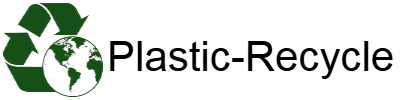

## 프로젝트 소개
플라스틱 종류를 판단할 수 있는 모델을 개발하고 이를 이용한 플라스틱 재활용 서비스 웹 개발
## 주요 기능 소개
1. 플라스틱 분류 모델
2. 개인별 플라스틱 분류 현황 확인
## 프로젝트 개발 소개
### 기능 별 리포지토리
* 통합 관리 : [PET-Recycling](https://github.com/Plastic-Recycling/PET-Recycling)
* 프론트 엔드 : [Front](https://github.com/Plastic-Recycling/Front)
* 백 엔드 : [Back](https://github.com/Plastic-Recycling/Back)
* 머신 러닝 : [ML](https://github.com/Plastic-Recycling/ML)

### 팀원 소개

|             고진혁                                                                              |                        이왕훈                                                                   |
|:--------------------------------------------------------------------------------------------:|:--------------------------------------------------------------------------------------------:|
|  |  |
|                         [@JinhyeokKo](https://github.com/JinhyeokKo)                         |                            [@52hater](https://github.com/52hater)                            |

### 사용 기술
#### Front-end

#### Back-end

#### ML

